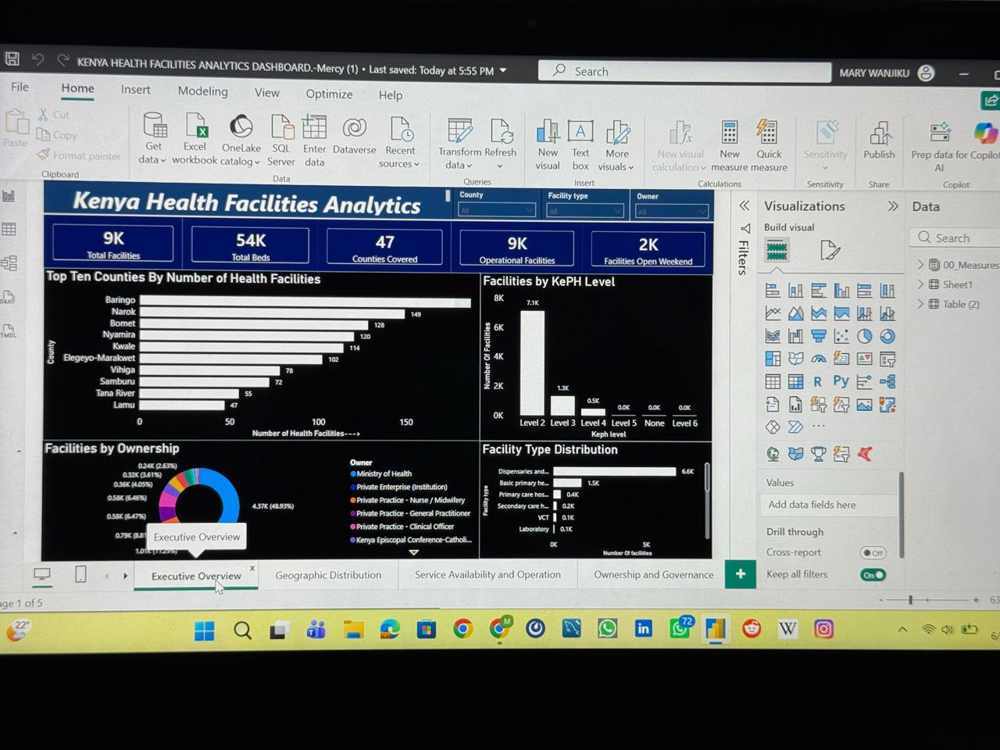
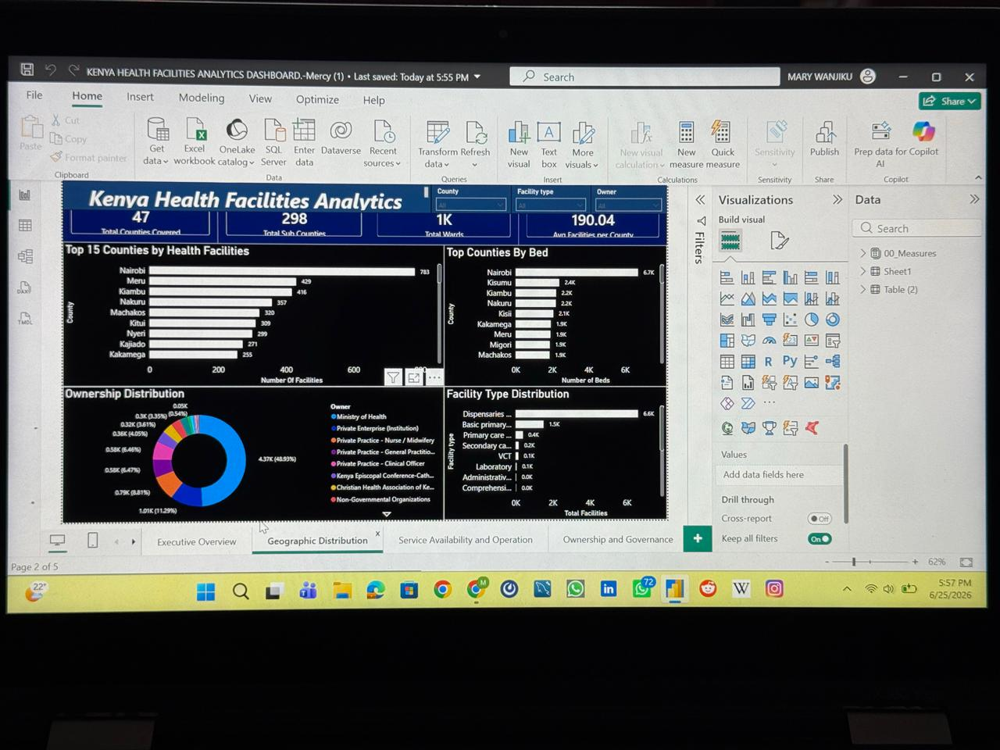
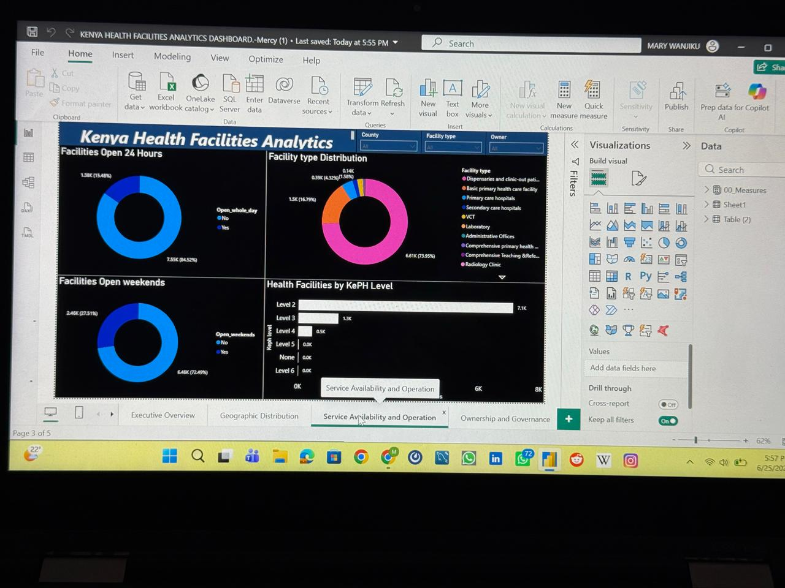
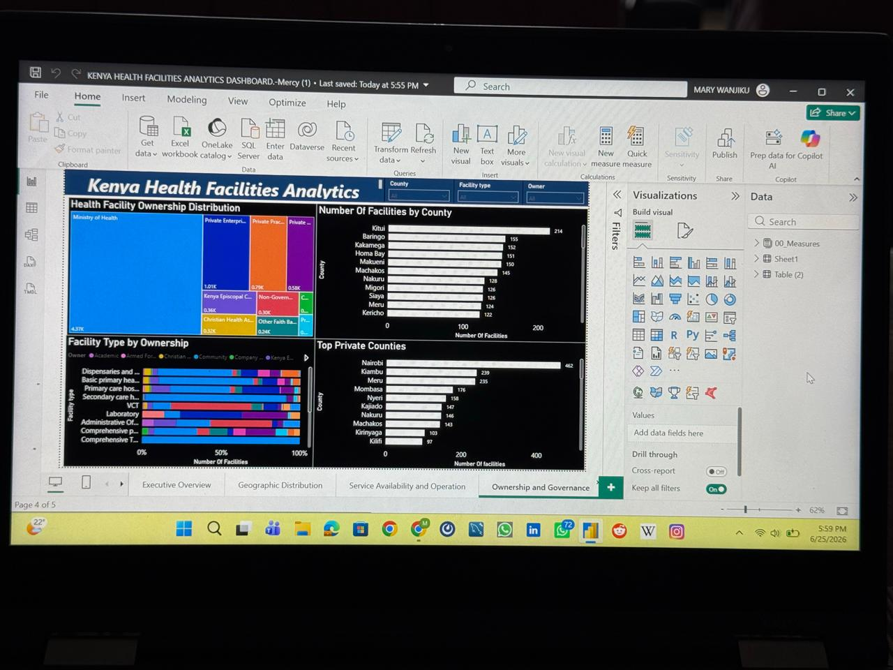
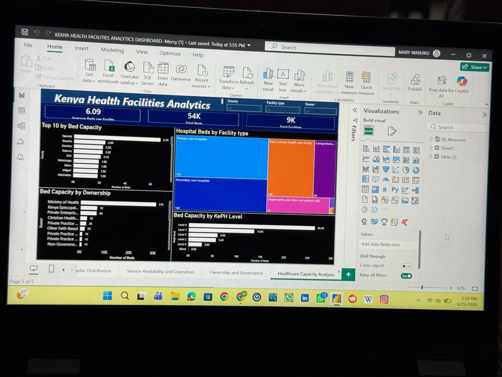

# Kenya_Health_Facilities_Analysis_Dashboard

### Author
# Mary Njeri Wanjiku
Data Analyst | Power BI, SQL, DAX | Business Intelligence for Finance & Fintech

## Project Overview
This Power BI dashboard provides a comprehensive analysis of healthcare facilities across Kenya. The project explores healthcare infrastructure distribution, facility ownership, service availability, operational status, and healthcare capacity indicators to support data-driven public health decision-making.

## Key Metrics
- 9,000+ Health Facilities
- 54,000+ Hospital Beds
- 47 Counties Covered
- Healthcare Capacity Analysis
- Ownership and Governance Analysis
- Service Availability Assessment

 ## Dashboard Pages
 
 #### Executive Overview

 #### Geographic Distribution

#### Service Availability and Operation

 #### Ownership and Governance

#### Healthcare Capacity

## Dashboard Insights

### Executive Overview
•⁠  ⁠Over 9,000 health facilities analyzed across Kenya.
•⁠  ⁠More than 54,000 hospital beds captured.
•⁠  ⁠All 47 counties represented.

### Geographic Distribution
•⁠  ⁠Facility distribution varies significantly across counties.
•⁠  ⁠Nairobi records the highest number of facilities and beds.

### Service Availability
•⁠  ⁠Most facilities operate during standard working hours.
•⁠  ⁠Weekend and 24-hour service availability varies by facility type.

### Ownership and Governance
•⁠  ⁠Ministry of Health facilities constitute the largest ownership category.
•⁠  ⁠Private, faith-based, and NGO facilities play a significant supporting role.

### Healthcare Capacity
•⁠  ⁠Bed capacity is concentrated in higher-level facilities.
•⁠  ⁠Level 4 and Level 5 facilities contribute disproportionately to national bed availability.

## Skills Demonstrated

- Power BI
- DAX
- Data Visualization
- Healthcare Analytics
- Dashboard Design
- Data Storytelling
- Public Health Informatics
- GitHub Documentation
